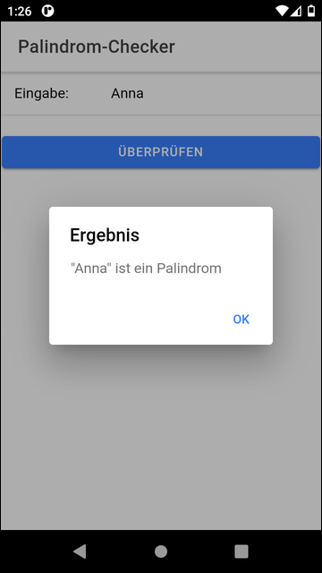

# Ionic app "Palindrome Checker" #

 

Ionic/Angular app representing a simple *Palindrome Checker*.
The actual check is implemented in [PalindromService](src/app/palindrom.service.ts),
which is to be put under unit test as exercise, i.e., unit tests are to be written in
[this file](src/app/palindrom.service.spec.ts).

 

----

## Screenshots ##

 

 &nbsp; 

 

----

## License ##

See the [LICENSE file](LICENSE.md) for license rights and limitations (BSD 3-Clause License)
for the files in this repository.
